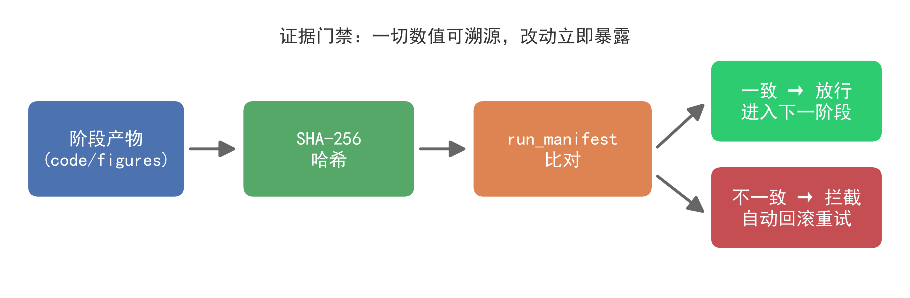
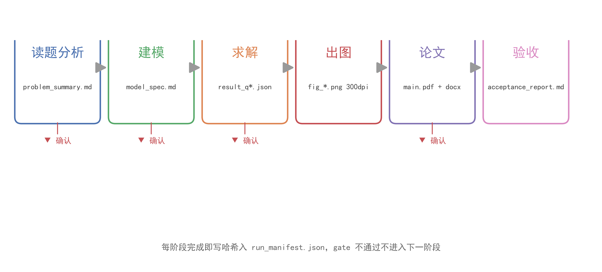

<div align="center">

# 🎓 数学建模全流程工作流

> **国赛 CUMCM · 六阶段自动化流水线 · 证据门禁防造假**

把赛题丢进 `problems/`，对 Claude Code 说一句 **"跑全流程"**，
它会自动完成 **读题 → 建模 → 求解 → 出图 → LaTeX 论文 → 自动验收** 的全部工作，
并在每个关键节点停下等你确认。

[](https://www.python.org/)
[]()
[]()
[]()
[]()

*人机协作 · 核心建模思路由你主导 · AI 负责加速实现*

</div>

---

## 🚨 新手必读：先看这里，能省 3 小时

> 这台机器上有几条**铁律**，违反任何一条都会卡住你。项目已内置防护，但你要知道为什么。

| 铁律 | 说明 |
|---|---|
| 🚫 **不要用裸 `python`** | 本机 PATH 里的 `python` 是 **Windows Store 假别名**，会弹商店或直接失败。**一律用 `$PYTHON_EXE`**（项目已配置指向 `.venv`）。 |
| 🚫 **路径含空格，命令必须双引号** | 项目路径是 `D:\Jupyter code\math_work`（**有空格**）。shell 命令里路径一律 `"..."` 包裹。 |
| 🚫 **装包只装进 `.venv`** | Anaconda 的 site-packages **不可写**，装不进去。依赖一律走项目虚拟环境：`bash scripts/setup_env.sh`。 |
| 🚫 **`problems/` 是只读存档区** | 只放赛题 + 附件。**一切产出必须落在 `solve/<赛题名>/` 下**，开工前先迁移（见快速开始 ③）。 |
| ⚠️ **控制台是 GBK 编码** | Python 输出中文乱码时，用 `PYTHONIOENCODING=utf-8`（项目已默认配置）。 |
| 🔒 **禁止编造任何数值** | 论文里的每个数字都必须能溯源到 `run_manifest.json` 的真实运行记录。**证据门禁**用哈希校验拦截一切手工改动。 |

<p align="center">
  
</p>

---

## 🚀 快速开始（4 步）

### ① 初始化（一次性）

```bash
cd "D:\Jupyter code\math_work"
bash scripts/setup_env.sh      # 装 Python 依赖（ortools、PyMuPDF）
bash scripts/init_project.sh   # 克隆 CUMCMThesis 模板、生成 config/machine.json
bash scripts/first_compile.sh  # 预热 LaTeX 模板（首次需联网装宏包）
```

> 💡 `config/machine.json`（机器路径）由 init 生成，**已 gitignore 不入库**；克隆仓库后第一次使用必须先跑上面的初始化。

### ② 放入赛题

在 `problems/` 下新建一个文件夹，放入：

- **赛题文件**：`*.pdf` / `*.docx`（无文本层的扫描版 PDF 需另附文本）
- **数据文件**：`*.csv` / `*.xlsx` / `*.txt`

### ③ 迁移到工作区

所有解题工作都在 `solve/<题名>/` 进行，先复制题目过去：

```bash
"$PYTHON_EXE" scripts/migrate_to_solve.py problems/2026_CUMCM_B
# 若 problems/ 侧有历史遗留 output/，加 --move-output 一并搬走
```

### ④ 跑全流程

在项目根目录启动 `claude`，然后说：

```
按 math-modeling-workflow 跑 solve/2026_CUMCM_B 全流程
```

工作流会先做环境自检，再按六阶段流水线推进，**每个关键节点暂停征求你的确认**（读题理解、模型假设、关键结果、论文审阅）。

---

## 🧭 六阶段流水线

<p align="center">
  
</p>

| 阶段 | 产出 | 人机交互 |
|------|------|----------|
| **P1 读题** | `analysis/problem_summary.md`（问题拆解 + 数据字典 + 参数清单） | ⏸ 向你复述理解，确认后继续 |
| **P2 建模** | `analysis/model_spec.md` + `analysis/symbols.md`（数学模型 + 方案对比） | ⏸ 确认模型与假设 |
| **P3 求解** | `code/solve_q*.py` + `code/result_q*.json`（可复现的真实结果） | ⏸ 展示关键数值，确认合理性 |
| **P4 出图** | `figures/*.png`（300dpi 论文级）+ 结构示意图 | 自动检查图质量 |
| **P5 论文** | `paper/main.tex` + `main.pdf` + `main.docx`（完整版 Word） | ⏸ 交付前全文审阅 |
| **P6 验收** | `acceptance_report.md`（11 步自动验收） | ⏸ 最终确认后交付 |

> 🔒 每阶段结束都会把产物哈希 + 运行命令写入 `run_manifest.json`（证据门禁），**gate 不通过绝不进入下一阶段**。任何手工改动产物都会因哈希不一致被拦下——阶段失败时自动回滚并重试，不会污染已通过的阶段。

---

## 📦 产出结构

```
solve/<赛题名>/output/
├── analysis/              # 题目分析、模型说明、符号表
├── code/                  # 求解代码 + 结果 JSON/TXT
├── figures/               # 论文图表 (300dpi) + 结构示意图源文件 (.drawio)
├── paper/                 # main.tex + main.pdf（可提交）+ main.docx（完整版 Word）
├── acceptance_report.md   # 11 步自动验收报告
└── run_manifest.json      # 证据门禁记录（每步运行的真实证据）
```

---

## 🗂 目录结构

```
├── .claude/skills/math-modeling-workflow/  # 工作流 skill（核心：六阶段 + MCP/skills 挂载点）
├── problems/               # 题目存档区（只读，仅赛题 + 附件）
├── solve/                  # 工作区（题目副本 + 全部产出）
├── templates/CUMCMThesis/  # 国赛 LaTeX 模板
├── tools/                  # 通用 Python 工具（出图/预处理/灵敏度/误差/图检查/Word 生成）
├── scripts/                # 初始化与迁移脚本
├── docs/                   # 参考文档（AI 使用说明、排版规范、提示词模板）
├── config/                 # machine.json（路径，init 生成）+ llm.json（密钥，不入库）
└── webapp/                 # Web 任务看板（可选）
```

---

<details>
<summary>🧩 三类工具协同（skills / MCP / 视觉）——点击展开</summary>

工作流在各阶段自动调用以下资产，完整说明见 `CLAUDE.md`「可复用资产」：

| 阶段 | Skills | MCP 服务器 | 视觉链路 |
|---|---|---|---|
| P1 读题 | — | qwen-mm-plugins（扫描版 PDF） | visualize → Read / vision_chat |
| P2 建模 | math-modeling-solver | paper-search-mcp（选型佐证）、context7 | — |
| P3 编程 | — | context7（查库 API）、github（找实现） | — |
| P4 出图 | dataviz、drawio-skill | qwen-mm-plugins（审图） | — |
| P5 论文 | — | paper-search-mcp（参考文献真实检索） | 读优秀论文关键页 |
| P6 验收 | — | — | — |
| P7 赛后迭代 | firecrawl-research-index | paper-search-mcp、firecrawl | 读优秀论文深读 |

</details>

<details>
<summary>✅ 端到端验证（demo 已跑通）——点击展开</summary>

内置 demo 题 `solve/demo-cumcm`（小型制造厂排班 + 产量预测）已完整跑通全流程：

- **六阶段全绿**：P1 读题 → P2 建模 → P3 CP-SAT 求解（总成本 15607 元、OPTIMAL）→ P4 出图（3 张 300dpi 图）→ P5 编译（11 页、零 overfull/undefined ref）→ P6 验收
- **验收 11/11 通过**：完整性、数值一致性、图表引用、LaTeX 编译、模型形式化、论文要素、格式规范、代码可复现、图质量、PDF 视觉等全部达标
- **证据门禁验证**：故意篡改一张产物图后 `gate` 立即拦截（hash 不一致），恢复后放行——防篡改机制生效

复现方式：

```bash
# 1. 重新生成 demo 题（可选，默认已在仓库中）
"$PYTHON_EXE" .claude/skills/math-modeling-workflow/scripts/make_demo.py

# 2. 触发工作流（在项目根启动 claude 后）
#    对 solve/demo-cumcm 跑 math-modeling-workflow 全流程
```

</details>

---

## ❓ 常见问题排查

| 现象 | 处理 |
|---|---|
| `python` 找不到 / 是 Store 假别名 | 一律用 `"$PYTHON_EXE"`（`.venv/Scripts/python.exe`），见新手必读 |
| ortools 导入报 `WinError 127` | 环境被污染，重跑 `bash scripts/setup_env.sh`（纯 pip venv，防 DLL 冲突） |
| 首次 LaTeX 编译很慢/报缺宏包 | MiKTeX 需联网自动装包，先跑 `bash scripts/first_compile.sh` 预热 |
| 编译报字体缺失 | 用 xelatex + SimSun/SimHei，勿用 pdflatex |
| 中文输出乱码 | 控制台 GBK，脚本内 `sys.stdout.reconfigure(encoding='utf-8')` |
| 论文数字与结果对不上 | 证据门禁拦截；从 `code/result_q*.json` 取真实值重填 |

---

## ⚖️ 合规说明

- 使用生成式 AI 辅助竞赛须按国赛规定在论文中**如实声明**（见 skill 的 `references/ai-usage-compliance.md`）
- 论文所有数值必须来自实际运行的代码（证据门禁保证），禁止编造
- 本工作流定位为**人机协作**：核心建模思路由你主导，AI 负责加速实现

---

<div align="center">

*本项目工作流由 **Claude Code（Anthropic）** 辅助搭建与优化。*

**🚀 祝你国赛旗开得胜！**

</div>
